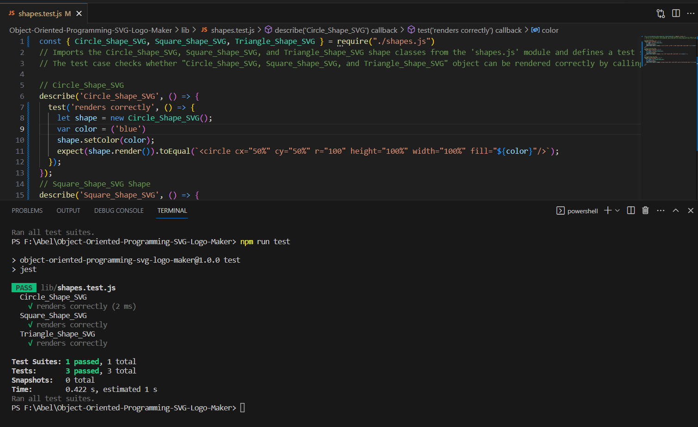
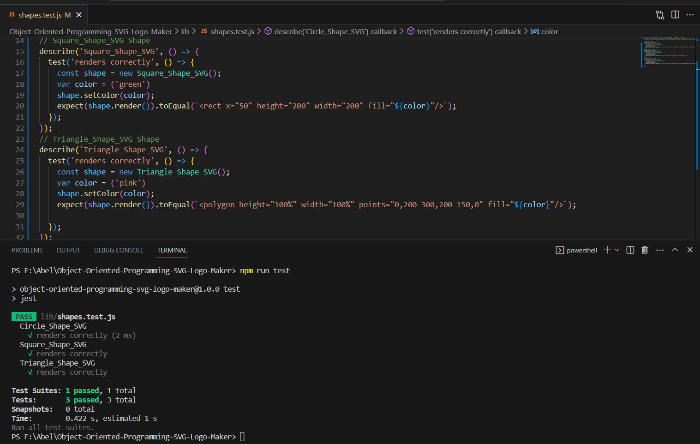
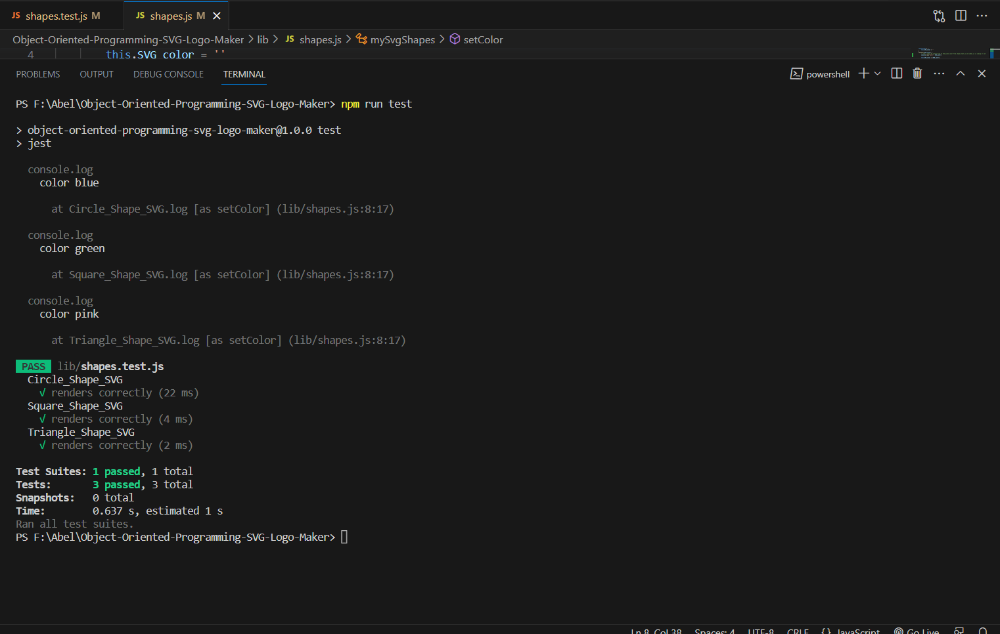
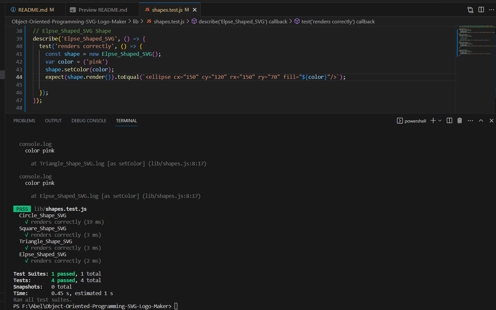

# Object-Oriented-Programming-SVG-Logo-Maker

# Description:

  This project is all about SVG logo file maker. This project will help a developer to generate his/her own SVG logo without having to worry about paying for another another graphic designer.

  One problem with most projects is that most developers pay for logo designer. This could be because of the laziness of the developer or doesn't want to work on it or the developer hasn't mastered down on how to create logo file. Also  possibly the developer hasn't a good idea of what to include with the logo.

  This SVG logo maker will allow the developer to answer a series of specific questions and create SVG logo based on the developer's response. It will take a couple minutes and provide the developer with the ability to make their project complete and more professional.

# Technology Used:

* Node JS
* inquirer dependancy 
* Jest for Unit testing

# Installation

first of all you need to have Node invironment in your local machine to run javascript file

step 1 : clone my repository to your local machine

step 2 :  open in terminal if you are in mac or linux operating system or in command prompt if you are in window

step 3 : type this command  ( cd Object-Oriented-Programming-SVG-Logo-Maker  ) to navigate to the project

step 4 : type this command ( code .) this helps to open in VS code

step 5 : when you are in VS code click the terminal tab from the VS code to open a terminal from VS code

step 6 : then type git status or git branch and make sure you are on the main branch

step 7 : type this command to install inquirer dependency ( npm i inquirer )

# Usage:

After installation is complete, you should follow those instructions

step 8 : finally type this command (node index.js) and run it .

step 9 : after you run it. it will allow the you to answer a series of specific questions.

step 10: after you have answered each questions it will create a logo.svg file in the root directory

step 11: that's it !

# Tests

  To test this app, open up the file in VS Code. Open the terminal, change directory into the root folder 'Object-Oriented-Programming-SVG-Logo-Maker’, and run ‘node index.js’. Answer the prompts and view the preview of the ‘logo.svg’ file in the ‘root directory’.

# Screenshots:

**Done!  congratulations**

walkthrough video link :
